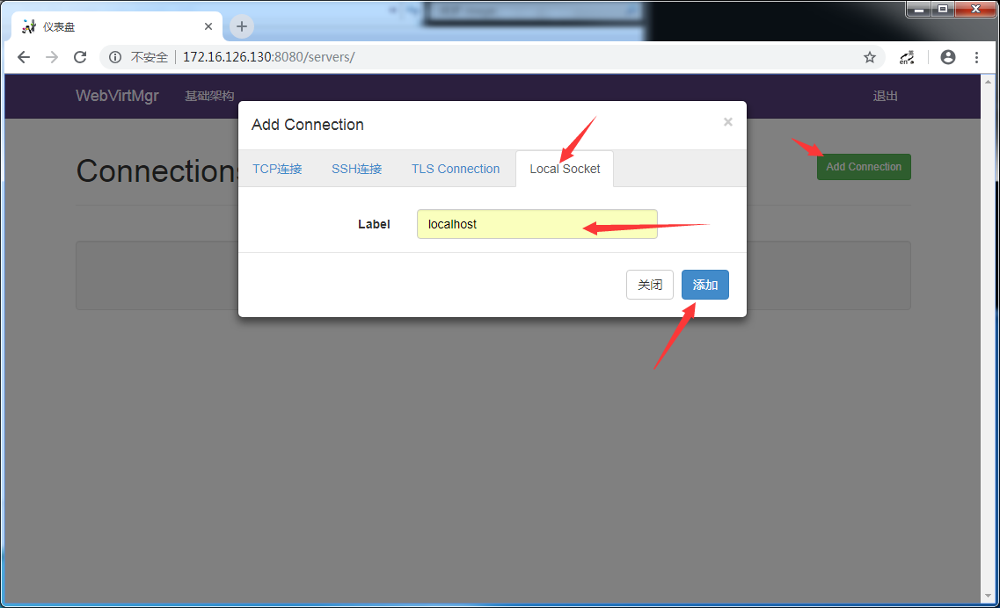

## Webvirtmgr+KvmDockerfile

1. Install [Docker](https://www.docker.com/).
```
$ yum install docker
```

2. Pull the image from Docker Hub

```
$ docker pull jieshao/web_kvm
```

### Usage

```
$ docker network create -d bridge web_kvm_net
$ docker run -p 8080:8080 -p 6080:6080 --privileged -v /dev:/dev -v /run/dbus:/run/dbus --network=web_kvm_net --network-alias web --name web_kvm  jieshao/web_kvm
```
### Test

```
docker run -p 8080:8080 -p 6080:6080 --privileged -v /dev:/dev -v /run/dbus:/run/dbus --network=web_kvm_net --network-alias web --name web_kvm  -it jieshao/web_kvm /bin/bash
```

### Open Browser
1. Url is Host:8080
2. User admin, pwd admin
3. Then add Connection by LocalSocket
 
4. Use it as you wish

### Reference resources
1. ianblenke/kvm
2. primiano/docker-webvirtmgr